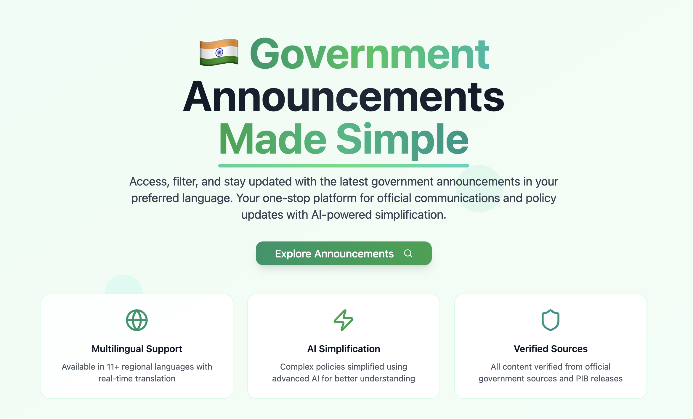
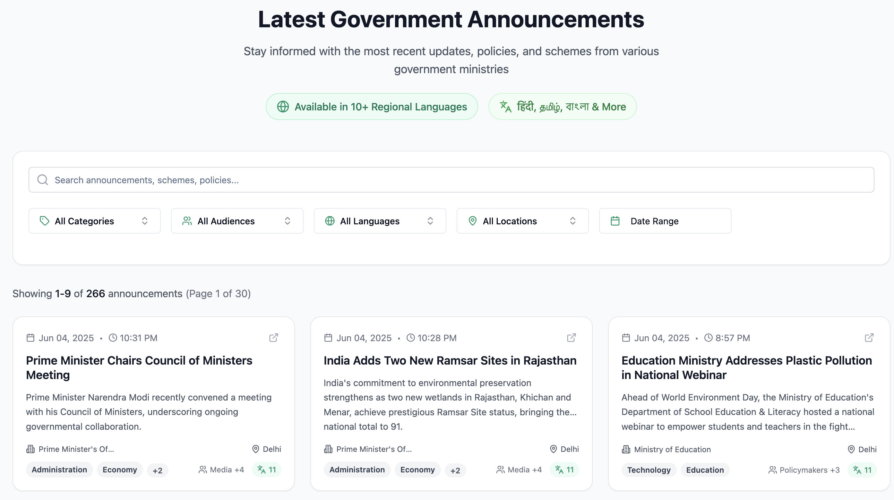
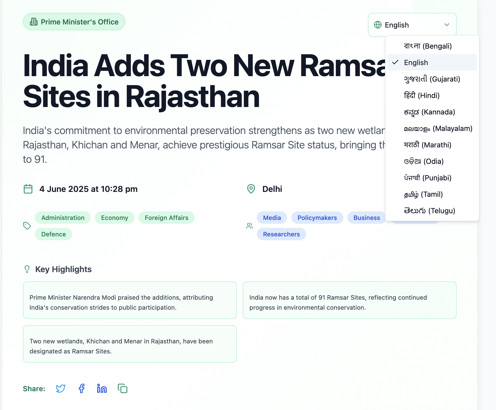
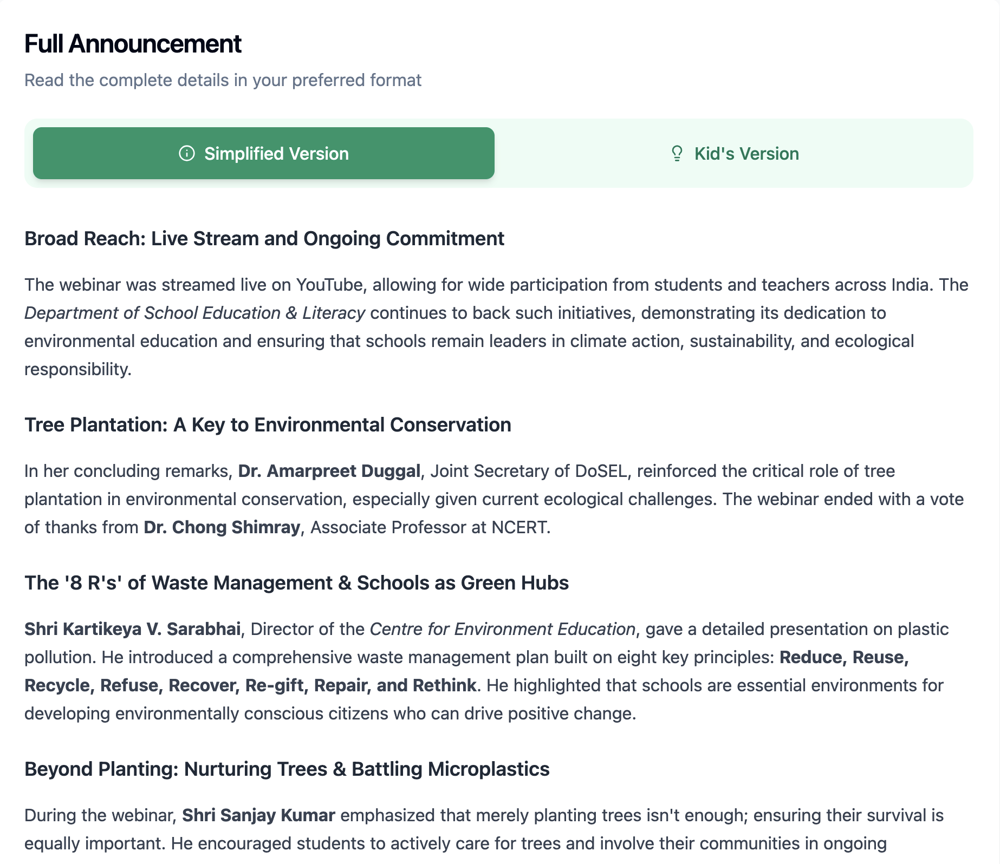

# Announce


[](https://announce.org.in)
[](https://github.com/kevinnadar22/announce/blob/main/LICENSE)
[](https://github.com/kevinnadar22/announce/stargazers)
[](https://github.com/kevinnadar22/announce/network/members)


<div align="center">
  
</div>
A modern platform that makes government announcements and circulars accessible to everyone by translating bureaucratic language into simple, understandable text and audio formats.

## Table of Contents

- [Overview](#overview)
- [Problem Statement](#problem-statement)
- [Features](#features)
- [Architecture](#architecture)
- [UI Screenshots](#ui-screenshots)
- [Contributing](#contributing)
- [License](#license)
- [Contact](#contact)

## Overview

Announce is a comprehensive platform designed to bridge the communication gap between government entities and citizens. By leveraging modern Large Language Models (LLMs), the platform automatically scrapes government announcements from official sources, processes them through intelligent translation and summarization algorithms, and presents them in an accessible format.

The platform consists of:
- **Backend**: Django REST Framework API with Celery-based scraping from pib.gov.in
- **Frontend**: Modern React application with TypeScript and Tailwind CSS
- **Data Processing**: RabbitMQ message queuing and automated content translation

## Problem Statement

The Indian government makes announcements and releases circulars in an extremely inaccessible variant of bureaucratic English. Regional governments sometimes only publish announcements in regional languages.

Using LLMs to translate government circulars and announcements into commonly spoken versions of different languages in both text and audio will make the government very accessible to the public.

Modern LLMs are amazing when used as translators. They can take in some text and render it in a different language with ease. And they can even change the style of writing: for example, you can ask a language model to "rewrite this letter using simple words so that a five year old can understand it".

LLMs can take in multiple modes of input: text, PDFs, audio transcripts and even just pictures.

The challenge is to find a way to fetch all government announcements made across all the different ministries and agencies across state and national governments, and then process and display them somewhere online where people can see it.

## Features

- **Automated Scraping**: Continuous monitoring of government websites for new announcements
- **AI-Powered Translation**: Smart translation into multiple languages with context preservation
- **Simplified Language**: Converts bureaucratic language into easily understandable text
- **Search & Filter**: Advanced search capabilities across all announcements
- **Mobile Responsive**: Optimized for all device types

## Architecture

The platform uses a distributed architecture with the following components:

- **Django REST Framework**: Backend API server
- **React + TypeScript**: Modern frontend application
- **Celery + RabbitMQ**: Asynchronous task processing and message queuing
- **PostgreSQL**: Primary database for structured data
- **Redis**: Caching, session management, and Celery Beat scheduler
- **MongoDB**: Optional - Used for storing Celery task results
- **LLM Integration**: Gemini API and Groq API for text processing

## UI Screenshots

### Platform Overview
The Announce platform provides a clean, modern interface for accessing government announcements with AI-powered translations and summaries.

### Announcement View


### Detail View



## Quick Start

### Prerequisites

- Python 3.9+
- Node.js 18+
- PostgreSQL
- Redis
- RabbitMQ (or CloudAMQP account)

### Setup

For detailed setup instructions, see the respective README files in the `backend/` and `frontend_react/` directories.

## Free Cloud Services

The following free cloud services can be used for hosting:

- **Database**: [Neon](https://neon.tech) - Free PostgreSQL hosting
- **Message Queue**: [CloudAMQP](https://cloudamqp.com) - Free RabbitMQ hosting
- **Redis**: [Redis.io](https://redis.io) - Free Redis hosting
- **Backend Hosting**: [Heroku](https://heroku.com) - Free tier available
- **Frontend Hosting**: [Vercel](https://vercel.com) - Free hosting for static sites
- **Database Alternative**: [MongoDB.com](https://mongodb.com) - Free MongoDB Atlas cluster

## Project Structure

```
announce/
├── backend/                 # Django REST Framework backend
│   ├── api/                # Django project configuration
│   ├── core/               # Main application logic
│   ├── secrets/            # Configuration files (dev/prod)
│   ├── requirements.txt    # Python dependencies
│   └── README.md          # Backend-specific documentation
├── frontend_react/         # React frontend application
│   ├── src/               # React source code
│   ├── public/            # Static assets
│   ├── package.json       # Node.js dependencies
│   └── README.md          # Frontend-specific documentation
└── README.md              # This file
```

## Contributing

1. Fork the repository
2. Create a feature branch (`git checkout -b feature/amazing-feature`)
3. Commit your changes (`git commit -m 'Add some amazing feature'`)
4. Push to the branch (`git push origin feature/amazing-feature`)
5. Open a Pull Request

## License

This project is licensed under the MIT License - see the [LICENSE](LICENSE) file for details.

## Contact

- **GitHub**: [kevinnadar22](https://github.com/kevinnadar22/announce)
- **Email**: jesikamaraj@gmail.com
- **Twitter**: [@kvnn22](https://x.com/kvnn22)
- **Website**: [announce.org.in](https://announce.org.in)